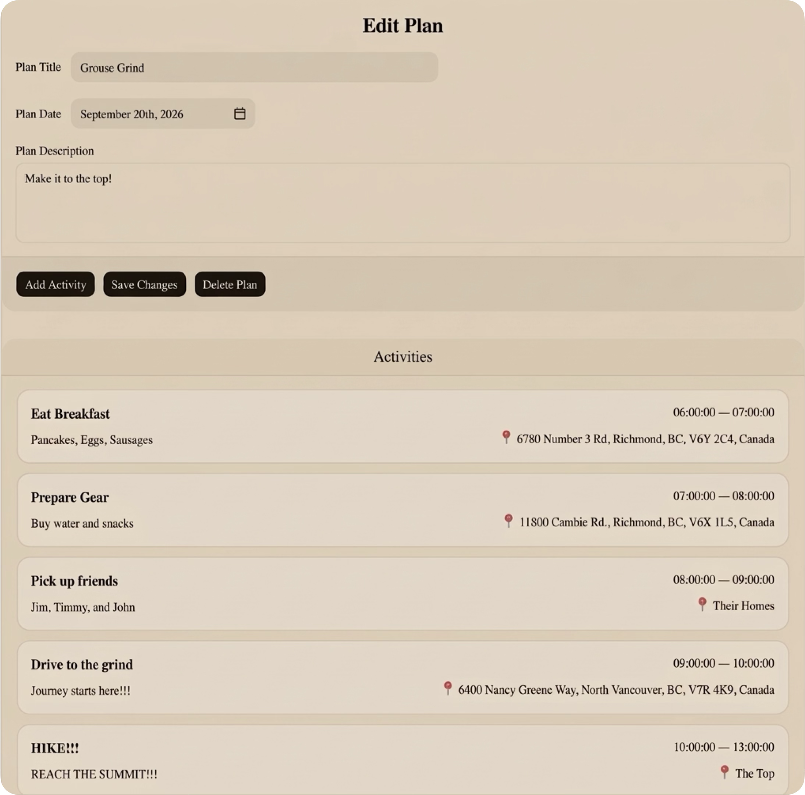

# Ourtinerary

> **Think it. Plan it. Do it.**
>
> A collaborative trip-planning platform for organizing itineraries, activities, and travel plans in one place.

### [View Live Demo →](https://ourtinerary.vercel.app/)

Ourtinerary is a full-stack web application for creating and organizing shared plans with structured dates, activities, locations, and plan membership. It was built to explore practical full-stack development patterns including authentication, client/server rendering, relational data modeling, reusable React hooks, and database-level authorization with Supabase Row Level Security (RLS).



## Why Ourtinerary?

Planning a trip or group activity often gets scattered across group chats, Notes apps, spreadsheets, and calendars. Ourtinerary provides a single place to turn an idea into a structured itinerary that can be managed as the plan evolves.

The project focuses on building a product that is simple for users while still demonstrating real engineering concerns behind the interface: authenticated data access, relational models, permission boundaries, reusable data-fetching logic, and a clear separation between UI and backend responsibilities.

## Current Features

- **Authentication** — Sign up, sign in, and authenticated session handling with Supabase Auth.
- **Plan management** — Create, view, edit, and delete plans with a title, description, and date.
- **Activity management** — Add, edit, and remove activities within a plan, including:
  - Activity title and description
  - Start and end times
  - Location information
- **Account dashboard** — View plans associated with the authenticated account.
- **Plan membership** — Associate users with plans and manage membership records.
- **Role-aware access control** — Plan members have clearance levels that determine what they can do.
- **Database-level authorization** — Supabase Row Level Security policies independently enforce access rules at the database layer.
- **Responsive UI** — Built with reusable React components and Tailwind CSS.

## Engineering Highlights

### Full-stack Next.js architecture

Ourtinerary uses the Next.js App Router with both Server and Client Components. Server-side routes handle authenticated requests where appropriate, while client-side hooks encapsulate interactive data operations.

### Supabase-backed data layer

Supabase provides authentication and PostgreSQL persistence. The data model separates core concepts into relational tables:

```text
profile
   │
   └── user

plan
   │
   ├── activity
   │
   └── plan_member ─── user

friend ─────────────── user
```

This keeps plans, activities, users, and memberships independently manageable while allowing relationships to be enforced through foreign keys.

### Defense-in-depth authorization

Authorization is not treated as a UI-only concern. The application performs client-side permission checks for a better user experience, while PostgreSQL RLS policies provide the authoritative database-level enforcement.

Current plan clearance levels are used to distinguish responsibilities such as:

| Clearance | Role | Example capabilities |
| --- | --- | --- |
| `0` | Host | Manage the plan and its membership |
| `1` | Editor | Modify plan details and activities |
| `2` | Member manager | Invite/add members where permitted |
| `3`+ | Read-oriented member | Access the plan without modification privileges |

This approach helps ensure that an unauthorized client cannot simply bypass frontend restrictions and directly mutate protected records.

### Reusable data hooks

Application data access is organized into focused hooks such as:

- `usePlans` — plan CRUD and plan fetching
- `useActivities` — activity CRUD and activity fetching
- `usePlanMembers` — membership and clearance management

This keeps UI components focused on presentation and interaction rather than duplicating database logic across pages.

## Tech Stack

| Layer | Technology |
| --- | --- |
| Framework | **Next.js 16** (App Router) |
| Language | **TypeScript** |
| UI | **React 19** |
| Styling | **Tailwind CSS 4** |
| Components | **shadcn/ui** / Base UI primitives |
| Backend & Database | **Supabase / PostgreSQL** |
| Authentication | **Supabase Auth** |
| Data Access | **Supabase JS + `@supabase/ssr`** |
| Date Utilities | **date-fns** |
| Icons | **Lucide React** |
| Linting | **ESLint** |
| Deployment-ready | **Vercel / Next.js** |

## Project Structure

```text
ourtinerary/
├── app/                    # Next.js routes and pages
│   ├── account/            # Account dashboard
│   ├── auth/               # Authentication pages
│   ├── plans/              # Plan creation and editing
│   ├── layout.tsx          # Root application layout
│   └── page.tsx            # Landing page
├── components/             # Reusable UI and feature components
│   ├── account/
│   ├── activity/
│   ├── plan/
│   └── ui/                 # Reusable UI primitives
├── hooks/                  # Client-side data and business logic
├── lib/
│   └── supabase/           # Browser/server Supabase clients
├── types/                  # TypeScript domain and database types
├── utils/                  # Shared application utilities
├── supabase/
│   ├── migrations/         # PostgreSQL schema and RLS policies
│   └── config.toml         # Supabase local configuration
├── public/                 # Static assets and product preview
└── package.json
```

## Getting Started

### Prerequisites

- Node.js 20+
- npm
- A Supabase project

### 1. Clone the repository

```bash
git clone <repository-url>
cd ourtinerary
```

### 2. Install dependencies

```bash
npm install
```

### 3. Configure environment variables

Create a `.env.local` file in the project root:

```env
NEXT_PUBLIC_SUPABASE_URL=your_supabase_project_url
NEXT_PUBLIC_SUPABASE_PUBLISHABLE_KEY=your_supabase_publishable_key
```

The application uses the public Supabase project URL and publishable key through both the browser and server-side Supabase clients.

### 4. Configure the database

Apply the SQL migration in:

```text
supabase/migrations/20260902073348_remote_schema.sql
```

The migration creates the application's core tables, relationships, indexes, authentication-linked records, and Row Level Security policies.

### 5. Start the development server

```bash
npm run dev
```

Then open [http://localhost:3000](http://localhost:3000).

## Available Scripts

```bash
npm run dev       # Start the development server
npm run build     # Create a production build
npm run start     # Start the production server
npm run lint      # Run ESLint
```

## Data Model

The core PostgreSQL schema is designed around four primary application concepts:

- **Plans** — the top-level container for an itinerary.
- **Activities** — scheduled items belonging to a plan.
- **Plan members** — the relationship between users and plans, including clearance levels.
- **Profiles** — application-level display information associated with authenticated users.

A separate `friend` relationship is also represented in the database schema and is planned to become part of the broader social collaboration experience.

Foreign keys and cascading deletes keep related records consistent. For example, activities and plan memberships are tied to their parent plan, so deleting a plan can clean up dependent records automatically.

## Security & Authorization

Security is implemented with multiple layers:

1. **Supabase Auth** identifies the current user.
2. **Server-side session handling** protects authenticated application routes.
3. **Client-side checks** provide immediate permission feedback in the UI.
4. **PostgreSQL Row Level Security** independently enforces authorization rules against database operations.
5. **Foreign keys** maintain referential integrity between users, plans, activities, and memberships.

This architecture is intentional: frontend checks improve UX, but the database remains the final authority for protected operations.

## Future Iterations

Ourtinerary is being developed iteratively. The next phase is focused on improving engineering quality, collaboration, and access control.

### Testing

Introduce automated tests across the application, including unit tests for business logic and integration/end-to-end coverage for critical user flows such as authentication, plan creation, activity management, and permissions.

### Improve UI Accessibility Across Device Dimensions

Enhance the UI to provide a more accessible and responsive experience across different device dimensions, including phones, tablets, and desktop screens. Ensure layouts, navigation, controls, and content adapt appropriately to different screen sizes while maintaining usability and accessibility across devices.

### Developer Tooling

Standardize the development workflow with additional tooling such as **Prettier**, improved linting/configuration, and consistent formatting conventions to make contributions easier to review and maintain.

### Friend System

Build a first-class friend experience so users can discover, connect with, and manage relationships with other users before collaborating on plans.

### Plan Invite System

Replace the current direct membership workflow with a more complete invitation flow, allowing users to invite others to specific plans and giving invitees an explicit way to accept or decline.

### Permission System

Expand and formalize the existing clearance-based access model into a more polished permission system with clearer roles, capabilities, and management controls for plan owners and members.

### Longer-term direction

Additional iterations may explore richer itinerary experiences, stronger collaboration workflows, notifications, and deeper validation as the product evolves.

## What This Project Demonstrates

Ourtinerary is more than a CRUD application. It demonstrates experience with:

- Designing a relational PostgreSQL schema for a collaborative product
- Building authenticated full-stack applications with Next.js
- Managing server and client data access boundaries
- Implementing database-level authorization with RLS
- Designing reusable React hooks for application state and data fetching
- Building reusable component systems with Tailwind CSS and shadcn/ui
- Modeling roles and permissions around real product requirements
- Structuring a codebase for continued feature development

## Status

**Active development — early product iteration**

The current version establishes the core planning workflow and technical foundation. Future iterations are intentionally scoped around reliability, developer experience, collaboration, and more granular authorization.

---

Built with Next.js, React, TypeScript, Tailwind CSS, and Supabase.
